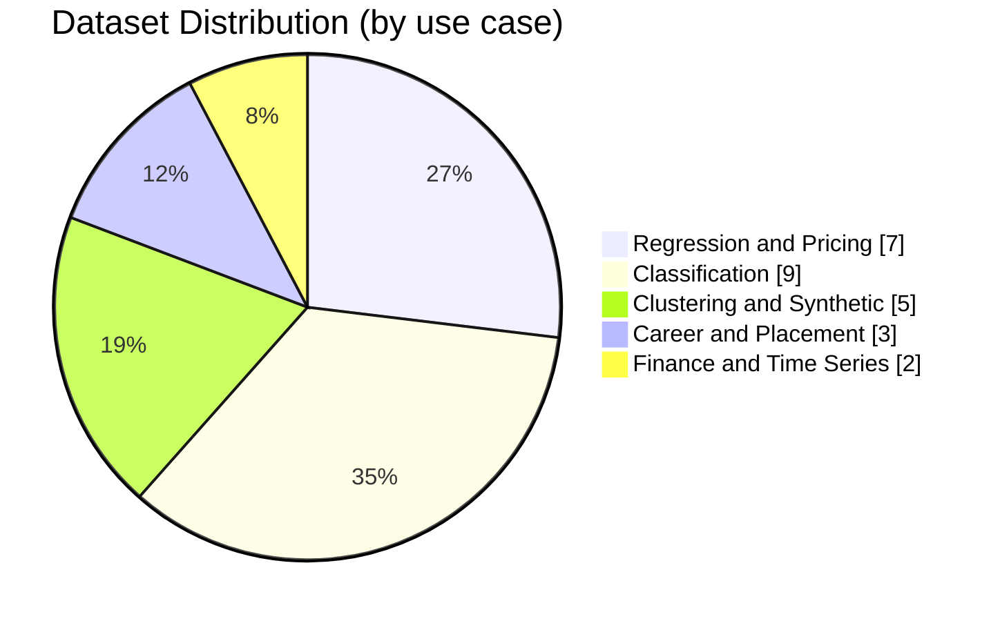

<<<<<<< Updated upstream
<div align="center">


<br/>

---

# 📊 Bhavya Kansal – Dataset Repository
=======
<p align="center">
    
</p>
>>>>>>> Stashed changes

# Bhavya Kansal - Dataset Repository

<p align="center">
    Curated CSV datasets for machine learning, analytics, and experimentation.
</p>

<p align="center">
    
    
    
    
</p>

## Overview

This repository is a practical collection of tabular datasets for:

- machine learning model training
- data preprocessing practice
- EDA and visualization projects
- interview and classroom assignments

Maintainer: Bhavya Kansal  
Portfolio: https://bhavyakansal.dev  
GitHub: https://github.com/BhavyaKansal20

## Repository Snapshot

| Metric | Value |
|---|---:|
| Total datasets | 26 |
| File format | CSV |
| Approx. storage | 4.02 MB |
| Largest dataset | House Prices.csv |
| Smallest dataset | Placement2.csv |

## Visual Dataset Mix



## Full Dataset Catalog

| Dataset | Rows | Columns | Size (KB) | Primary Use |
|---|---:|---:|---:|---|
| Boston.csv | 506 | 15 | 36.8 | Regression |
| Crop.csv | 620 | 12 | 38.4 | Classification |
| DBSCAN_DATA.csv | 500 | 2 | 18.0 | Clustering |
| House Prices.csv | 21613 | 21 | 2190.0 | Pricing Regression |
| Placement2.csv | 100 | 3 | 1.0 | Placement Classification |
| Salary Data.csv | 375 | 6 | 18.9 | Salary Regression |
| Salary.csv | 375 | 3 | 4.8 | Salary Regression |
| Social_Network_Ads.csv | 400 | 5 | 10.7 | Binary Classification |
| Titanic-Dataset.csv | 891 | 12 | 59.8 | Survival Classification |
| bitcoin.csv | 2785 | 7 | 180.7 | Time Series Analysis |
| breast-cancer.csv | 569 | 32 | 121.7 | Medical Classification |
| car data.csv | 301 | 9 | 16.8 | Price Prediction |
| car.csv | 301 | 9 | 16.8 | Price Prediction |
| diabetes.csv | 768 | 9 | 22.6 | Medical Classification |
| houseprice.csv | 21613 | 13 | 1008.5 | House Price Regression |
| iris copy.csv | 150 | 5 | 4.6 | Multiclass Classification |
| iris.csv | 150 | 5 | 4.6 | Multiclass Classification |
| loan.csv | 614 | 13 | 37.1 | Loan Risk Classification |
| medical_data.csv | 4240 | 16 | 187.3 | Healthcare Analytics |
| placement.csv | 200 | 2 | 2.1 | Placement Insights |
| polynomial.csv | 200 | 2 | 2.1 | Curve Fitting |
| polynomial1.csv | 200 | 2 | 2.1 | Curve Fitting |
| polynomial2.csv | 200 | 2 | 2.1 | Curve Fitting |
| polynomial_classification.csv | 10000 | 2 | 117.1 | Decision Boundary Classification |
| student_placement.csv | 1000 | 3 | 12.5 | Student Placement |
| unlabeled_iris.csv | 150 | 4 | 2.5 | Unsupervised Practice |

## Quick Start

Clone the repository:

```bash
git clone https://github.com/BhavyaKansal20/Datasets.git
cd Datasets
```

Load any dataset with Python:

```python
import pandas as pd

df = pd.read_csv("diabetes.csv")
print(df.shape)
print(df.head())
```

Load all CSV files in one go:

```python
from pathlib import Path
import pandas as pd

datasets = {}
for csv_path in Path('.').glob('*.csv'):
        datasets[csv_path.name] = pd.read_csv(csv_path)

print(f"Loaded {len(datasets)} datasets")
```

## Repository Standards

- Use descriptive commit messages for dataset updates.
- Keep files in CSV format unless a format migration is announced.
- Preserve headers and data types when modifying files.
- Add source or context in PRs when introducing new datasets.

## License and Usage

This repository is licensed under BSD-2-Clause. See LICENSE for details.

Important usage note:

- Some datasets may originate from public sources.
- You are responsible for complying with upstream licensing.
- Prefer educational and research use unless source terms allow otherwise.

## Contribution and Security

- Contribution guide: see CONTRIBUTING.md
- Code of conduct: see CODE_OF_CONDUCT.md
- Security policy: see SECURITY.md

## Contact

- Website: https://bhavyakansal.dev
- GitHub: https://github.com/BhavyaKansal20

If this repository helped your project, star it to support future dataset drops.
